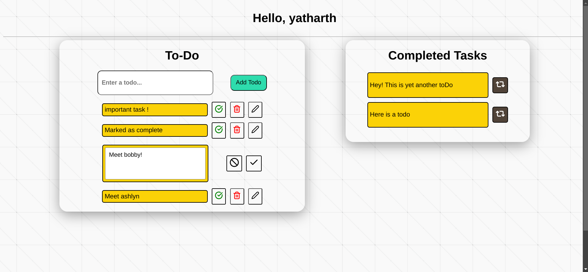

# TODO

Welcome to **TODO**, a sleek and modern task management application designed to help you stay focused and organized. With a user-friendly interface and a minimalist design, **TODO** provides a distraction-free environment to boost your productivity.




### Product UI
Designed with a minimalist approach, the user interface ensures that you can focus on what matters: **your tasks**. The modern design minimizes distractions, allowing you to channel your productivity into getting things done.


## Features

With **TODO**, you can:
- 📝 **Sign In / Sign Up**: Securely create an account or log in to start managing your tasks.
- ➕ **Create New To-Dos**: Add tasks effortlessly and organize them in your task list.
- 🗑️ **Update & Delete To-Dos**: Modify existing tasks or remove them when no longer needed.
- ✅ **Mark Tasks as Done**: Keep track of your progress by marking tasks as completed.
- 📋 **View All Your To-Dos**: See your current tasks at a glance to stay on top of things.


## 🛠️ Getting Started

Ready to get started with **TODO**? Follow these steps to set up the project locally:

### 1. Clone the Repository
```bash
git clone https://github.com/yatharth-singh-panwar/ToDo.git
cd ToDo
```

### 2. Install all the dependencies
```bash
npm install
cd backend
npm install
cd ..
```

### 3. Run the backend server
```bash
node backend/index.js
```

### 4. Navigate to the localhost:3001 port on your browser
```bash
#In your broser, type
http://localhost:3001
```
